## アクセスコントロールアプリ -AccessCtrl-

本アプリケーションは、許可されたPCからのみWEBサーバへのアクセスを許可する、いわゆる「端末制限」のためのサンプルアプリです。概要はこんな感じです↓

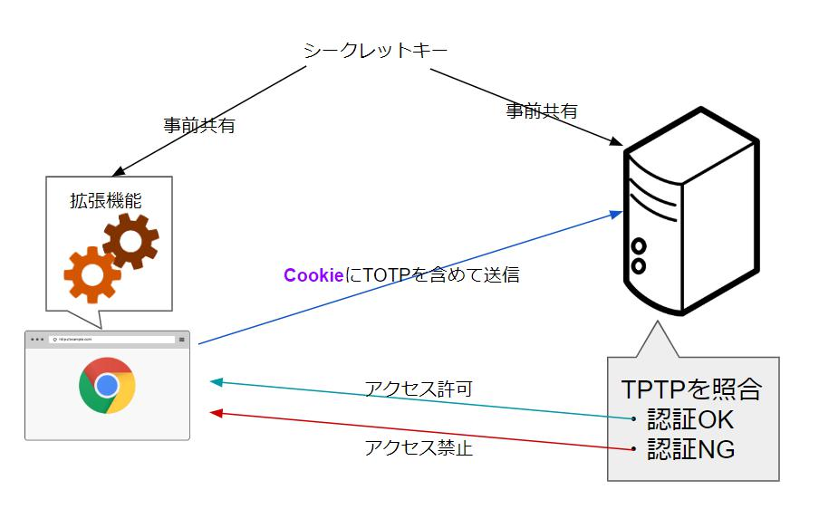

クライアント側(図の左)にはChrome(他のブラウザでは動作確認未実施)の拡張機能をインストール、サーバ側(図の右)はウェブサービスに簡単なスクリプト(今回はPHP)を組み込むことを想定してます。

クライアント側の設定はブラウザに拡張機能をインストールするだけで、お手軽な割にそこそこのセキュリティが担保できる仕組みです。小～中規模くらいの自前のウェブサービスで利用する場合に便利だと思います。

本アプリはサンプルなので、そのままだと実用には堪えないです。ご自身の環境に合わせて改修して使ってもらうか、端末制限実現の参考までにしてもらえればればと思います。

## 端末制限について

昨今、働き方改革だのでリモートワークについてあちこちで言われてますけど、リモートワーク自体は昔からあるわけでVPN使えばいいわけですよ。じゃあなんで使わないのかというと、ある程度はコストが掛かるし設定も面倒くさいしで、雇われる側がやる気だしても経営者側がその気になんないと中々リモートワークは実現できないだろうと思いますね。

それに社外から接続できるってのは、謂わば「特例」ですから、多かれ少なかれリスクになりえるので、上手く運用しないとそれ自体がセキュリティホールにもなるかもしれない、経営者側からすると導入に二の足を踏むというのも理解できなくはないです。

端末制限を実現するための方法として、私がパッと思いつくのが以下の4つの方式です。簡単な説明も書いておきましたが、WEBで検索するともっと詳しい説明がいっぱいあるので、興味のある方はご自身で調べてみてください。

- <b>VPN</b>

  一番間違いない方法。真剣にセキュリティを考えるならば多少のコストはかかっても実績がある商品のVPNを導入したほうがいいです。独自アプリをインストールする必要があったりとか専用機器を購入する必要があったりものなどもあって、方式が何種類あるのでニーズにあったものを購入するといいと思います。

- <b>証明書を使った認証</b>

  VPNの一種。TLSのオプションの規格でクライアント証明書による認証を利用する。有効期限を設定できるし、運用を間違えなければセキュアではあるけど、認証局からクライアント証明書を発行する必要があり、方法にもよるがコストがかかる。自前で認証局を用意する手もあるがそれはそれで手間がかかる。商品として提供されているものを使わずに自力でやるとなると、ちょっと難易度が高いかもしれない。自力での構築で複数サービスでの利用を求められた場合に、設定が複数箇所に及ぶとなると結構面倒だと思う。

- <b>IPアドレス制限</b>

  仕組みが分かりやすく割と簡単に実現できる。アプリケーション内部のプログラムでもできるし、ファイアーウォールの設定でもできる、ApacheやNginxの設定でも可能です。でも、クライアント側が固定IPアドレスじゃないといけないので、毎回アドレスが変わるポケットWi-Fiやスマホのテザリングだと使えない。

- <b>クッキー(Cookie)を使った認証</b>

  https通信の使用が前提です。事前にクライアントの端末にパスコードとなるCookieを設定しておき、その値を検証することにより端末制限を実現します。SaaSアプリにこの機能を組み込むと便利だと思います。すごくお手軽ですがCookieを削除すると使えなくなり、再生っていが必要になります。また、Cookieの属性の設定を失敗するとパスコードが漏洩する危険性もあります。

本アプリケーションは最後のクッキーを使う方式をベースに、それにひと手間加えてTOTPの要素を付け加えてます。

## 構築＆使い方

本サンプルアプリの構築手順です。大まかには、クライアント側・サーバ側の両方で環境構築して、両方でシークレットキーを共有します。

#### クライアント側の設定

Chromeに拡張機能をインストールします。

1. サンプルソースをダウンロードして、適当な場所に配置します。GitHubの「Clone or download」でダウンロードできます。「AccessCtrl_client」フォルダをクライアント側で利用します。

   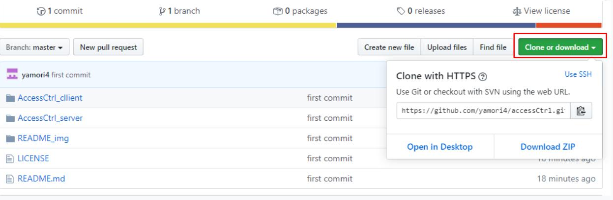

2. chromeの拡張機能の設定画面を開く。アドレスバーに「chrome://extensions/」と入力する。

   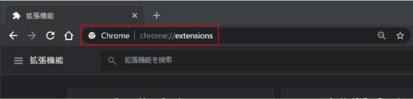

3. "デベロッパーモード"を"ON"にし、「パッケージ化されていない拡張機能を読み込む」ボタンをクリックします。

   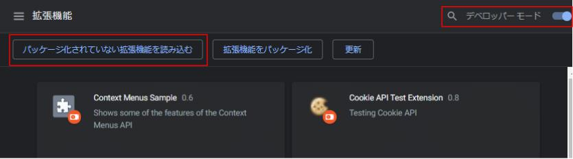

   【補足】デベロッパーモードをONにすると、次回のChromeの起動時に以下のようなメッセージが表示されるようになります。これを表示しないようにするにはGoogleのウェブストアに拡張機能を公開して、そこからダウンロードして利用すればいいです。(※ちょっとお金がかかります。)

   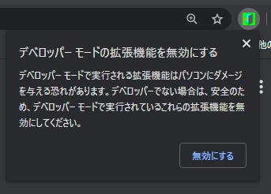

4. ダウンロードしたサンプルソースのフォルダーを選択して取り込みます。

   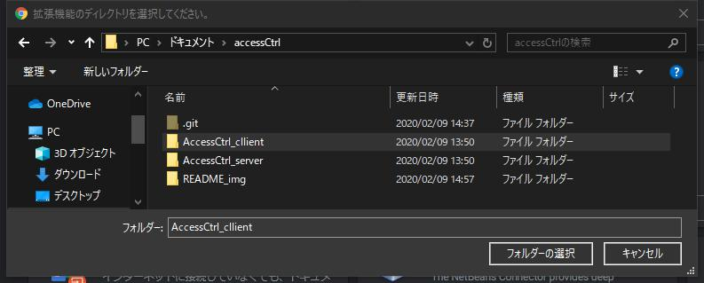

5. 取り込みが完了すると拡張機能の一覧と、アドレスバーの横に取り込んだアプリが表示されます。

   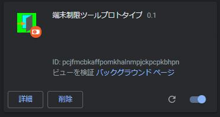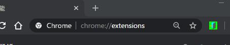

   

#### サーバ側の設定

Webアプリケーションにスクリプトを組み込みます。

1. ウェブサーバの構築します。サンプルはPHPなので、それが動く環境であれば何でもいいですが、ここではXamppを使います。(※Xamppの設定手順はこちらを参考にしてください→https://github.com/yamori4/objectOriented/blob/master/_readMe/installXampp.md)

2. サンプルソースをダウンロードして、xamppの制御下に配置します。「C:\xampp」にインストールした場合だと「C:\xampp\htdocs」というフォルダあるので、その配下に配置します。ソースコードはGitHubの「Clone or download」でダウンロードできます。「AccessCtrl_server」ファイルをサーバ側で利用します。

   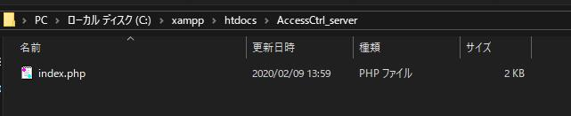

3. XamppのApacheを起動します。Apacheの「Startボタン」をクリックします。

   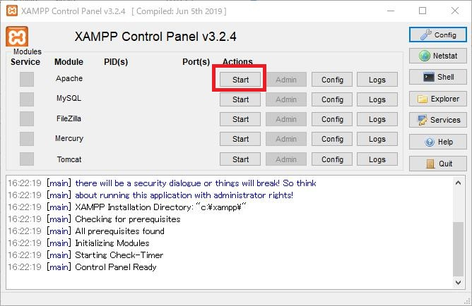

4. Chromeを起動して、アドレスバーに「 https://localhost/AccessCtrl_server/index.php 」と入力してみてください。以下のような画面が表示されます。

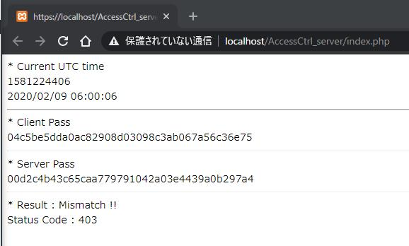

#### シークレットキーの共有設定

クライアント側とサーバ側で共通のキーを設定します。ここでは共通のシークレットキーを「OpenSesame」としています。

1. Chromeのアドレスバー横にあるアイコンをクリックします。

   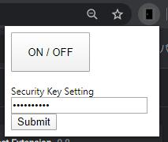

2. 「Secret Key Setting」欄に「OpenSesame」と設定し、「Submit」ボタンをクリックします。(※画面上では伏字になってますが、すでに初期値として設定しています。)

3. 「ON/OFF」ボタンをクリックして拡張機能アプリを"ON"にします。そうするとアイコン画像が変化します。(※使用しない時はOFFにしておけばいいです。)

   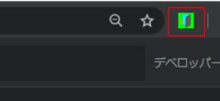

4. 次はサーバ側にシークレットキーを設定します。「 https://localhost/AccessCtrl_server/index.php 」のindex.phpファイルをメモ帳などで開き、4行目の「SECRET_KEY」の値を「OpenSesame」と設定し、保存します。

   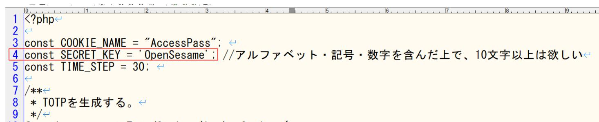

5. これで、シークレットキーの設定は完了です。Chromeでウェブページを見てみましょう。CookieのTOTPの値がサーバ側で生成したTOTPの値が一致しており、認証に成功しています。

   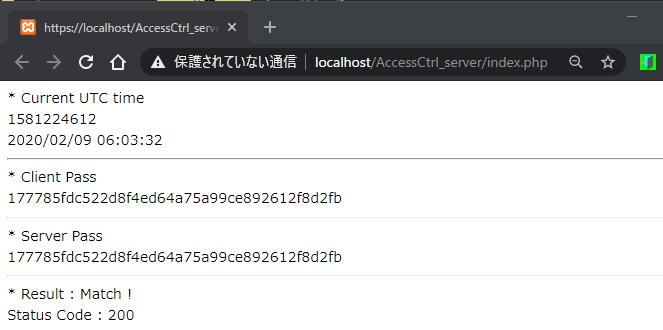

   また、試しに間違ったシークレットキーに設定してみます。TOTPの値が一致せず認証に失敗します。こういった場合にHttpStatusCodeで403を返したり、ログイン処理をさせなかったり、強制ログアウトを実施したりしてアクセスを禁止すればいいです。

   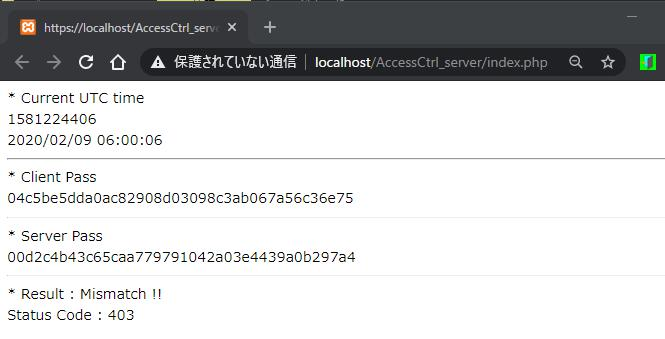

<b>以上</b>

